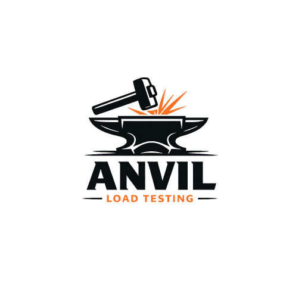
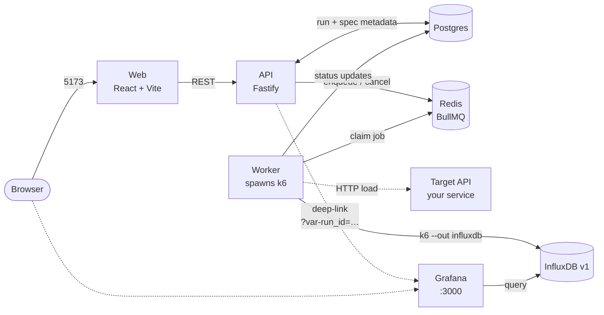

<p align="center">
  
</p>

<h1 align="center">Anvil</h1>

<p align="center">
  Self-service load testing for any OpenAPI service.<br/>
  Paste a URL, pick operations, configure parameters, and run k6 load tests
  with results streaming to InfluxDB + Grafana.
</p>

---

Anvil bundles its own InfluxDB and Grafana so `docker compose up` is the
entire setup. It auto-discovers OpenAPI/Swagger specs, lets devs pick which
endpoints to hit, supports six load profiles (smoke, load, stress, spike,
soak, custom), and stores every run with pass/fail thresholds, optional
setup/teardown hooks, and parameterized test data.

## Architecture



Boxed services run in `docker-compose`. The dashed line to **Target API** is
the system under test — bring your own, or use the bundled
[sample target](./samples/target-api).

## Phase 1 scope

- Discover OpenAPI/Swagger spec from a base URL (probes common paths)
- Pick operations + configure path/query/header params and bodies
- Bearer-token auth for the target API
- Two load profiles: `smoke` (1 VU, 30s) and `load` (custom VUs + duration)
- Async runs via Redis + BullMQ; runner shells out to `k6 run`
- Metrics tagged with `run_id`, `service`, `triggered_by` and pushed to InfluxDB v1
- Run history in Postgres; deep-link to Grafana with `run_id` filter

Deferred to later phases: portal auth, target host allowlist, more profiles,
saved tests, OAuth on target APIs, fixture data, SLOs/notifications, k8s runner pool.

## Stack

| Layer    | Tech                                   |
| -------- | -------------------------------------- |
| API      | Fastify + TypeScript                   |
| Worker   | BullMQ consumer + k6 child process     |
| Web      | React + Vite + Tailwind                |
| Storage  | Postgres (app), Redis (queue)          |
| Metrics  | InfluxDB v1 (existing) + Grafana       |

## Repo layout

```
.
├── api/         # HTTP API: discover, runs CRUD, queue producer
├── worker/      # BullMQ consumer; generates k6 script and runs it
├── web/         # React frontend
├── infra/       # init.sql (postgres schema)
├── docker-compose.yml
└── .env.example
```

## Quick start

```bash
cp .env.example .env
docker compose up --build
```

That brings up the full stack including a tiny [sample target API](./samples/target-api)
on `:8080`. In the portal at http://localhost:5173, paste
`http://target-api:8080` into the discover form to see the four sample
endpoints — instant first run, no real API needed.

If you have your own API and don't want the sample running, comment out the
`target-api` service in `docker-compose.yml` (or move it back behind a
profile — `profiles: ["sample"]`).

That's it. The compose stack brings up everything self-contained:

| Service     | URL                                       | Notes                                       |
| ----------- | ----------------------------------------- | ------------------------------------------- |
| Web portal  | http://localhost:5173                     | Discover APIs, configure runs, view results |
| API         | http://localhost:4000                     | REST API consumed by the web app            |
| Grafana     | http://localhost:3000                     | Anonymous Editor role; admin/admin to log in |
| InfluxDB v1 | http://localhost:8086 (db `k6`)           | k6 metrics are written here                 |
| Postgres    | localhost:5432 (postgres/postgres)        | Run history + spec cache                    |
| Redis       | localhost:6379                            | BullMQ job queue                            |

The Grafana dashboard "Anvil" is auto-provisioned on first
boot via `infra/grafana/provisioning`. The portal's **Open in Grafana** button
deep-links to it with `var-run_id`, `var-service`, and a time window pinned to
the run's `started_at` / `finished_at`.

### Bringing your own InfluxDB / Grafana

If you'd rather use existing instances, override these in `.env`:

```
INFLUXDB_URL=http://your-influx-host:8086/k6
GRAFANA_BASE_URL=https://grafana.your-org.example
GRAFANA_DASHBOARD_UID=anvil
```

For the dashboard on an external Grafana, import `infra/grafana-dashboard.json`
(it has `__inputs` so Grafana prompts for a datasource on import). The
`infra/grafana/dashboards/anvil.json` variant is for the bundled
Grafana's auto-provisioning and references a hardcoded datasource UID.

You can `docker compose up --scale influxdb=0 --scale grafana=0 …` to skip the
bundled instances entirely.

### Editing the dashboard

`infra/grafana-dashboard.json` is the canonical import-format dashboard.
After you tweak it (or paste a new export from Grafana), regenerate the
auto-provisioning variant:

```bash
./infra/sync-dashboard.sh
```

The script drops `__inputs`/`__requires` and rewrites `${DS_INFLUXDB}` to the
literal `influxdb-k6` UID that the provisioned datasource registers. Both
files end up consistent.

#### Panels included

- **Stats** (top row): total requests, failure rate %, p95 latency, max VUs.
- **Requests over time** + **Failure rate over time**.
- **Latency percentiles** (p50/p95/p99 + avg) on one chart.
- **Virtual users** (step plot showing the load profile shape).
- **Iterations over time**.
- **p95 by operation** — broken out by the `operation` tag the worker sets
  (`METHOD path`), useful for spotting one slow endpoint.
- **Status codes** — stacked bar chart by HTTP status, surfaces error spikes.

Both `run_id` and `service` are template variables. The deep-link from the
portal sets `run_id`; `service` defaults to "All".

## Running locally without Docker

Each app has its own `package.json` and can be run with `npm run dev`. You'll
need Postgres + Redis + k6 installed locally.

## Safety guards

Four optional env vars control resource and target limits. Empty/unset = no
limit.

| Var | What it does |
| --- | --- |
| `TARGET_HOST_ALLOWLIST` | Comma-separated hostnames; supports `*.suffix` wildcards. Both `/discover` and `POST /runs` reject targets outside this list (HTTP 403). |
| `MAX_VUS` | Caps peak VUs per run (HTTP 403). |
| `MAX_DURATION_SECONDS` | Caps total duration per run (HTTP 403). For ramping profiles this is the sum of all stages. |
| `MAX_CONCURRENT_RUNS` | Caps number of simultaneously queued + running tests (HTTP 429). |

`POST /runs/:id/rerun` re-validates against current settings, so tightening a
limit will block reruns of older runs that violate it.

## License

MIT — see [LICENSE](./LICENSE).

## Extension points

- **Load profiles**: `worker/src/k6-script.ts` — add stages for stress/spike/soak.
- **Auth types**: `worker/src/k6-script.ts` — currently injects Bearer token via
  env var; extend `buildHeaders` for API-key / OAuth.
- **Spec discovery**: `api/src/lib/openapi.ts` — list of probe paths and parser.
- **Runner isolation**: `worker/Dockerfile` bundles Node + the k6 binary. To
  move to k8s later, replace the worker's `child_process.spawn('k6', ...)` with
  a Job creation call against the cluster.
